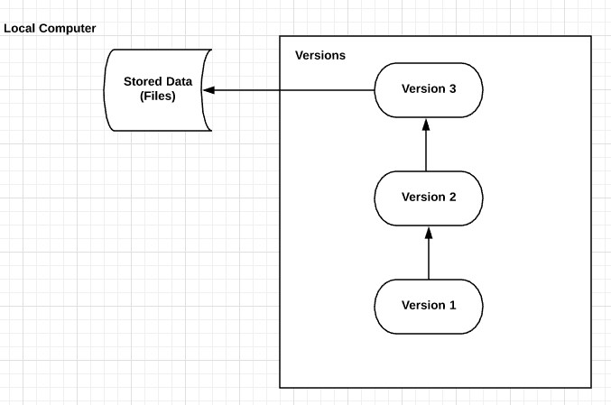

# GitHub
```{r echo=FALSE, fig.align='center', out.width=950, out.height=450}
knitr::include_graphics("images/github.png")
```

---
# GitHub
## motivation

* When working on a project, there are usually different people working on the same file/folder
* You want to avoid sending each modification by email
* You could use dropbox/google drive and the likes but it is good practice to keep track of modifications and have a platform to plan and discuss changes

---
# GitHub
## motivation

GitHub allows you:
- record the entire history of a file;
- revert to a specific version of the file;
- collaborate on the same platform with other people;
- make changes without modifying the main file and add them once you feel comfortable with them.

---
# GitHub
## motivation

GitHub will be used for:
- work in group on projects and homeworks;
- submit projects/homeworks;
- develop R packages and website;
- ...

---


---
# In fact, what is Git?

Git is a **distributed version control system**.

* **distributed**: whenever you instruct Git to share files, Git does not only share the latest file version, but instead, it distributes **every version** it has recorded for that project.

* **version control system**: many people are used to have *their own version control system* e.g. by having different versions of the same file (`file_v1.R`, `file_v2.R`, ...). This approach is error-prone and ineffective when working in team project. Thus, a version control system keeps track of changes to modification in your project.

---
# Types of VCS
## Local

.pull-left[
```{r echo=FALSE, fig.align='center', out.width=451, out.height=300}

```
]

.pull-right[
* One of the simplest and most commonly used VCS
* It keeps patch sets (modification of a file) locally (on your computer)
* It can recreate the file at any point in time by adding up the patches
]

---
# Types of VCS
## Centralized


---
# GitHub
## ready?

.center[
<iframe src="https://giphy.com/embed/sG4PBWRjI4GSVCDXEq" width="480" height="480" frameBorder="0" class="giphy-embed" allowFullScreen></iframe><p><a href="https://giphy.com/gifs/nickelodeon-drama-club-sG4PBWRjI4GSVCDXEq">via GIPHY</a></p>
]

---
# GitHub
## Basic workflow

The basic workflow is as follows...

1. Open the RStudio Project connected to your Git(Hub) Repo
2. Work on your computer just like always
3. **Save** your work often just like always
4. When you want to preserve a **snapshot** of your project, you make a "commit"
5. When you have a few commits and want to archive them, you "push" them to the GitHub remote server
6. If you decide to work from a different computer, or want to pick up where a collaborator left off, you can "pull" the most up-to-date version of the files from the GitHub remote to your local computer and go back to step 2.

---
class: sydney-blue, center, middle

# Demo on RStudio

---
# GitHub
## Files states in Git
A file can have three primary states: **modified**, **staged** or **committed**

* **modified**: a file is modified but not recorded;
* **staged**;

---
# GitHub
## New habits
* When you want to preserve a **snapshot** of your project, you make a "commit."
* When you have a few commits and want to archive them, you "push" them to the GitHub remote server.
* If you decide to work from a different computer, or want to pick up where a collaborator left off, you can "pull" the most up-to-date version of the files from the GitHub remote to your local computer.

---
# GitHub
## Commits
Make your commit message as informative and concise as possible.

```{r echo=FALSE, fig.align='center', out.width=439, out.height=250}
knitr::include_graphics("images/git_commit.png")
```

---
# GitHub
## "pull" before you "push"
Make sure you have the up-to-date version of your project before working on it.

Try to avoid the headaches of "merge conflict".

.center[
<iframe src="https://giphy.com/embed/cFkiFMDg3iFoI" width="480" height="269" frameBorder="0" class="giphy-embed" allowFullScreen></iframe><p><a href="https://giphy.com/gifs/git-merge-cFkiFMDg3iFoI">via GIPHY</a></p>
]

---
# GitHub
## Common mistakes (and how to solve them)

* **Commits in the wrong Repo**. Nothing seems to work? It's a common mistake. Solution: make sure you work on the correct RStudio project that is correctly linked to GitHub.

* **Large files error**. GitHub blocks pushes that exceed 100 MB. Solution: find another solution for large files (Dropbox, ...)

* **Conflict (not merge)**. Conflicts may happen when two collaborators make different changes to part of a program at the same time but on different lines of code. One of them push the modification to the remote. The second one to push will have a conflict as his/her version of the project is "outdated". Solution: `git pull --rebase`

* **Merge conflict**. It happens when two collaborators work on the same lines of code at the same time. It is often a problem of miscommunication within groups and lack of organization. Solution: To resolve these conflicts, we must directly edit the documents making sure potential conflicts are discussed before pushing.

---
# GitHub

> git gets easier once you get the basic idea that branches are homeomorphic endofunctors mapping submanifolds of a Hilbert space.
> <cite> Isaac Wolkerstorfer </cite>

---
class: sydney-blue, center, middle

# Question ?

.pull-down[
<a href="https://ptds.samorso.ch/">
.white[`r icons::fontawesome("file")` website]
</a>

<a href="https://github.com/ptds2021/">
.white[`r icons::fontawesome("github")` GitHub]
</a>
]
